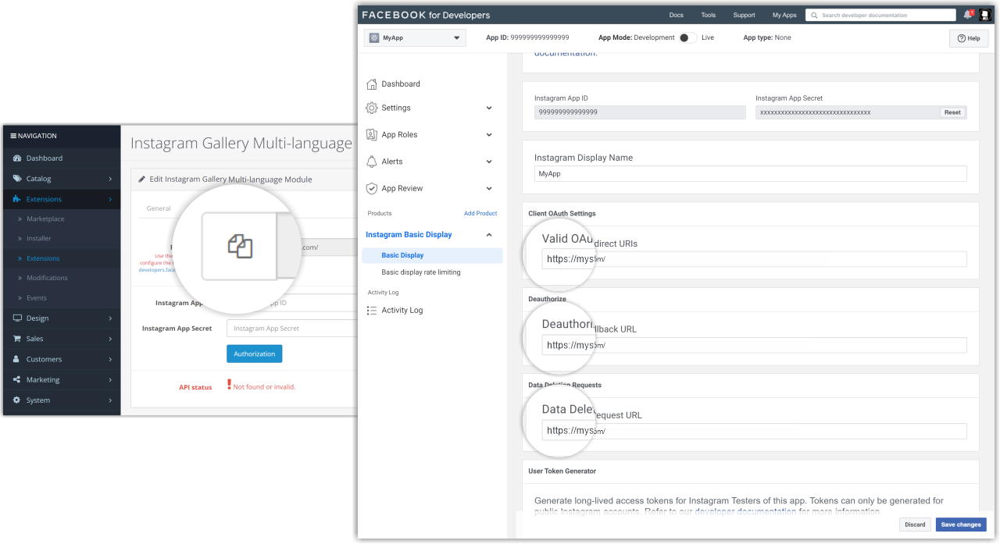

## Instagram Gallery Multi-language - OpenCart v3.x (OCMOD)

#### [Module page](https://www.opencart.com/index.php?route=marketplace/extension/info&extension_id=44728&filter_member=Rodrigoabr)

- [Welcome](#welcome)
- [Overview](#overview)
- [Resources](#resources)
- [Prerequisite](#prerequisite)
- [Upload files](#upload-files)
- [Install the module](#install-the-module)
- [Galleries](#galleries)
  - [Create a Main Gallery](#create-a-main-gallery)
  - [Create a Clone Gallery](#create-a-clone-gallery)
- [API configuration (Main Galleries only)](#api-configuration-main-galleries-only)
  - [Create a Facebook App](#create-a-facebook-app)
  - [Instagram Basic Display and API Configuration Module](#instagram-basic-display-and-api-configuration-module)
  - [Add an Instagram Test User](#add-an-instagram-test-user)
  - [Authenticate the User](#authenticate-the-user)
- [General configuration tab](#general-configuration-tab)
- [View configuration tab](#view-configuration-tab)
- [Display the gallery in the layout.](#display-the-gallery-in-the-layout)
- [Access and Modification Permissions](#access-and-modification-permissions)
- [Uninstall](#uninstall)
- [Troubleshooting](#troubleshooting)
- [Licence](#licence)
- [How to get help](#how-to-get-help)
- [Contact](#contact)
- [Buy me a coffee](#buy-me-a-coffee)

# Welcome
Welcome to the documentation for the Instagram Gallery Multi-Language module for Opencart versions 3.x.

# Overview
Display your Instagram posts directly on your store with ease. Utilize Meta's official API to showcase your Instagram posts as an image gallery on your online store. Create a variety of visualizations, add effects, titles, subtitles, links to the original media post, navigation buttons, pagination buttons, and much more. Configure the API once and create multiple galleries, each with a unique visualization style, and display them in different layouts.

# Resources
+ 3 types of visualization
+ Title
+ Caption
+ Pagination
+ Link to original Instagram post
+ Image Effects
+ Clone gallery (Multiple galleries with a single API)
+ Available in
   - English (en-gb)
   - Portuguese (pt-br)

# Prerequisite
+ OpenCart v3.x installed as public website with SSL certificate (**SSL certificate is required for API integration**.).
+ A <a href="https://developers.facebook.com/" target="_blank">Facebook Developer Account</a>.
+ An <a href="https://www.instagram.com/" target="_blank">Instagram account</a>.
+ The user must have the following access and modification permissions:
  - *Dashboard > Extensions > Installer*
  - *Dashboard > Extensions > Extensions*
  - *Dashboard > Extensions > Modifications*
  - *Dashboard > Design > Layout*

To grant or revoke permissions, refer to the [Access and Modification Permissions](#access-and-modification-permissions) section.

# Upload files
Go to **_Extensions_ > _Installer_**. In the form that appears, click on the **_Upload_** button.

Please locate the previously downloaded file **instagra_gallery_multilang_3.x.ocmod.zip**, select it, and click on the **_Open_** button or double-click on the file name.

Please wait for the installation to finish, then the module will be listed in the **_Install History_** table.

Go to **_Extensions_ > _Modifications_** and click on the **_Refresh_** button.

# Install the module
Go to **_Extensions_ > _Extensions_**, select **_Modules_** from the dropdown menu, locate the **_Instagram Gallery Multilang_**, and then click on the **_Install_** button at the end of the line.

# Galleries
About gallery types
>There are two ways to create a gallery:
>1. [_Main Gallery_ or _Parent Gallery_](#create-a-main-gallery): This type of gallery will contain the Instagram API configuration. Multiple Main Galleries can be created, each with a different API configuration.
>2. [_Clone Gallery_ or _Child Gallery_](#create-a-clone-gallery): This type of gallery will use the API settings of the Main Gallery. Multiple Clone Galleries can also be created for each Main Gallery.

## Create a Main Gallery
Go to **_Extensions_ > _Extensions_**, select **_Modules_** from the drop-down menu, locate the **_Instagram Gallery Multilang_**, and then click on the **_Edit_** button at the end of the line.

Enter the name of the _new gallery_ and click on the Save button. The name of the gallery can be changed later.

## Create a Clone Gallery
Go to **_Extensions_ > _Extensions_**, select **_Modules_** from the select menu, locate the **_Instagram Gallery Multilang_** then click on the **_Edit_** button at the end of the line.        

Enter the name of the new _child gallery_, select the _parent gallery_ and click the Save button. The name of the gallery can be changed later.

# API configuration (Main Galleries only)
This chapter/tutorial demonstrates how to configure an Instagram App in the app dashboard and how to set up the API for the module.
>Before you start, make sure you already have a <a href="https://developers.facebook.com/" target="_blank">Facebook Developer Account</a>  and the store is not in maintenance mode.
<!-- 

 -->

## Create a Facebook App
Go to <a href="https://developers.facebook.com/" target="_blank">Facebook Developer Account</a>, click **_My Apps_**, and create a new app.

Choose the **_Consumer_** or **_None_** app type.

Add an app name.

After creating the app, go to the App Dashboard, navigate to **_Settings > Basic_**, scroll to the bottom of page, and click **_Add Platform_**.

Choose **_Website_** and click **_Next_**.

Add your website’s URL, and save your changes.
>
>Click on this button to copy the store's URL.

## Instagram Basic Display and API Configuration Module
Click on **_Products_**, locate the **_Instagram Basic Display_** product, and click **_Set Up_** to add it to your app.

Scroll to the bottom of the page and click **_Create New App_**.

Enter the name of the Facebook app that you just created.

Please go back to the API tab of the module, copy the store URL, and paste it into the **_Valid OAuth Redirect URIs_**, **_Deauthorize callback URL_** and **_Data Deletion Request URL_**, then click 'Save.

In the Instagram Basic Display form, copy the **_Instagram App ID_** and **_Instagram App Secret_** numbers and paste them in the API tab of the module.

## Add an Instagram Test User
Please navigate to **_Roles > Roles_** and scroll down to the **_Add Instagram Testers_** section. Then, click **_Add Instagram Testers_** and enter your Instagram account's username before sending the invitation.

Open a new web browser and go to instagram.com. Sign into your recently invited Instagram account. Navigate to **_(Profile Icon) > Edit Profile > Apps and Websites > Tester Invites_**, and accept the invitation

Your Instagram account is now eligible to be accessed through your Facebook app.

## Authenticate the User
Go to the API tab of the module and click on the **_Authorization_** button.

Click the **_Open Authorization Window_** button or copy and paste the link into your browser. It is necessary to be logged into the Instagram account that will provide the media for the gallery.

The authorization window should appear and display your Instagram username, the name of the app, and a description of the permissions it is requesting. Click **_Authorize_** to grant the app access to your profile data.

Please access the module page and refresh it. Then, go to the API tab and verify that the API status displays the correct configured API message.

The setup for Instagram Basic Display and Module API is complete when the API status displays the correct configured API message. Set the General and View settings, and click the 'Save' button at the top of the page to create your gallery.

# General configuration tab

+ **Name**: This text is used to identify the gallery. Duplicate names for galleries are not permitted.
+ **Title**: The title that will be displayed above the gallery allows you to use HTML and CSS.
+ **Types of posts**: Types of Instagram posts that will provide content for the gallery.
+ **Album media type**: Types of media that will be provided from the albums.
+ **Images from album**: The quantity of media that will be provided from the albums.
+ **Update**: Period during which the oldest image in the gallery will be updated.
+ **Status**: Gallery status.

# View configuration tab

+ **Media per view**: The maximum number of media that will be displayed.
+ **View type**: Type of visualization.
+ **Pagination**: Show pagination bullet points.
+ **Zoom effect**: Type of zoom effect while mouse hovers over the image.
+ **Rounded edges**: Apply rounded edges to the images.
+ **Skew**: Apply a tilt effect to the image.
+ **Color effect**: Type of color effect when the mouse hovers over the image.
+ **Caption**: Display part of the post caption.
+ **Link original post**: Access the original posts by clicking on the images.
+ **Mobile**: Display the gallery on devices with a screen resolution of less than 576px.

# Display the gallery in the layout.
Go to **_Design_ > _Layouts_**, find the layout where you want to display the gallery, and click **_Edit_** at the end of the row.

Choose the position in which the gallery will be displayed. In the drop-down menu, locate the gallery by name, click the **_Add Module_** button, and save the changes.
In this example, we will configure the gallery to be displayed at the Content Bottom.

# Access and Modification Permissions
Go to **System > Users > Users Groups**, locate your group by name, and click **_Edit_** at the end of the row.

In the **_Access Permissions_** and **_Modification Permissions_** lists, find the line **_extension/module/instagram_gallery_multilang_** and make sure it is checked.

# Uninstall

When uninstalling the module, all settings, galleries, and media will be deleted. 

Go to **_Extensions > Installer_**, locate the module, and click **_Uninstall_** at the end of the row.

# Troubleshooting
Access the <a href="https://github.com/ab-rodrigo/instagram-gallery-multilang-docs/blob/main/troubleshooting.md" target="_blank">Troubleshooting</a>.  page.

# Licence
GNU General Public License version 3 (GPLv3) - https://www.gnu.org/

# How to get help
[Module page](https://www.opencart.com/index.php?route=marketplace/extension/info&extension_id=44728&filter_member=Rodrigoabr)

Please access the module page and click on the 'Get Support' button.

# Contact
Rodrigo Barbosa - ab.rodrigo@outlook.com

# Buy me a coffee

