## Instagram Gallery Multi-language for Opencart 3.x(OCMOD) and 4.x

-blue.svg?logo=data:image/svg+xml;base64,PD94bWwgdmVyc2lvbj0iMS4wIiBlbmNvZGluZz0iVVRGLTgiPz4NCjwhRE9DVFlQRSBzdmcgUFVCTElDICItLy9XM0MvL0RURCBTVkcgMS4xLy9FTiIgImh0dHA6Ly93d3cudzMub3JnL0dyYXBoaWNzL1NWRy8xLjEvRFREL3N2ZzExLmR0ZCI+DQo8IS0tIENyZWF0b3I6IENvcmVsRFJBVyAyMDIwICg2NCBCaXQpIC0tPg0KPHN2ZyB4bWxucz0iaHR0cDovL3d3dy53My5vcmcvMjAwMC9zdmciIHhtbDpzcGFjZT0icHJlc2VydmUiIHdpZHRoPSIyOS45MzI3bW0iIGhlaWdodD0iMjMuMTM0OG1tIiB2ZXJzaW9uPSIxLjEiIHN0eWxlPSJzaGFwZS1yZW5kZXJpbmc6Z2VvbWV0cmljUHJlY2lzaW9uOyB0ZXh0LXJlbmRlcmluZzpnZW9tZXRyaWNQcmVjaXNpb247IGltYWdlLXJlbmRlcmluZzpvcHRpbWl6ZVF1YWxpdHk7IGZpbGwtcnVsZTpldmVub2RkOyBjbGlwLXJ1bGU6ZXZlbm9kZCINCnZpZXdCb3g9IjAgMCA1Mjc0LjMgNDA3Ni40NyINCiB4bWxuczp4bGluaz0iaHR0cDovL3d3dy53My5vcmcvMTk5OS94bGluayINCiB4bWxuczp4b2RtPSJodHRwOi8vd3d3LmNvcmVsLmNvbS9jb3JlbGRyYXcvb2RtLzIwMDMiPg0KIDxkZWZzPg0KICA8c3R5bGUgdHlwZT0idGV4dC9jc3MiPg0KICAgPCFbQ0RBVEFbDQogICAgLnN0cjAge3N0cm9rZTojRkVGRUZFO3N0cm9rZS13aWR0aDoyNDguNjQ7c3Ryb2tlLW1pdGVybGltaXQ6MjIuOTI1Nn0NCiAgICAuZmlsMCB7ZmlsbDojRkVGRkZGfQ0KICAgXV0+DQogIDwvc3R5bGU+DQogPC9kZWZzPg0KIDxnIGlkPSJDYW1hZGFfeDAwMjBfMSI+DQogIDxtZXRhZGF0YSBpZD0iQ29yZWxDb3JwSURfMENvcmVsLUxheWVyIi8+DQogIDxwYXRoIGNsYXNzPSJmaWwwIHN0cjAiIGQ9Ik0zNjI2LjQ2IDI5MzAuODFsMTE1LjQ4IC05MS4xOWMxMy44NywtMTIuNzQgMjIuMjQsLTI1Ljc0IDM2LjI4LC0zNi45NWwzNzYuMDQgLTMyMC45OGM5NS4yNCwtODYuNDUgMTk5LjAxLC0xNjMuMjkgMjk3LjAxLC0yNTkuMjdsNTc2LjE2IC01MzYuMzJjMTM1LjMzLC0xNTQuNzQgMTk3LjQsLTMyOS44IC0yMS4yNSwtNDMwLjkzIC0zODMuMzksLTE3Ny4zMiAtMTYxNi4xNywtMTQyLjMyIC0yMDg3LjcyLC0xNDAuNDUgLTcwNC42MSwyLjggLTEzMTkuNjQsOC4yNSAtMTk3MC4xNywtMjY0LjI5IC0xMzAuMiwtNTQuNTQgLTI0My4zNywtMTIyLjA4IC0zNTYuOTksLTE5OS4wMSAtNTYuNCwtMzguMiAtMTEyLjQ0LC03NS41NCAtMTYyLjgxLC0xMTguOGwtMTUwLjM0IC0xMjkuMzNjNDMuNTIsMTIwLjI2IDIwMS45MywzMTUuNDMgMjk0LjQ0LDQyMS4wMiA0MS43NCw0Ny42OCA4Mi41Nyw3NC43NiAxMjQuNzcsMTE2LjMzIDU0LjQ3LDUzLjY0IDIxOC4zNCwxNjMuOTQgMjgzLjgsMTk4LjcyIDYzMS4wMSwzMzUuMjMgMTM0NS41NywzMjIuMjQgMjA4NC43MiwzMjUuMDUgMzM1Ljk3LDEuMjcgMTAxNC43MSwwLjgzIDEzMjYuNzksMTIyLjk5IDI2MC4yMiwxMDEuODYgMTQxLjcyLDI1My42OCAxMS45Niw0MjcuNDcgLTczLjcyLDk4Ljc4IC0xOTUuMDEsMjI1LjM4IC0yODAuNSwzMjIuNjhsLTExNi4yMyAxMjUuMDVjLTI4LDI2LjI3IC0zNi40NCwzNC4xNyAtNTkuMzgsNjEuMDZsLTE0NC40NSAxNTYuOTZjLTEwLjgsMTIuNCAtMTUuNywyMS4yNyAtMjYuOTQsMzMuNzQgLTQ3LjcsNTIuODYgLTEzNC4zNiwxNDYuMjMgLTE1MC42NywyMTYuNDJ6Ii8+DQogIDxwYXRoIGNsYXNzPSJmaWwwIHN0cjAiIGQ9Ik0xNDc0LjY4IDMyNDguMjRjLTEwOC40MiwyMy44OCAtMTY4Ljg4LDc2LjY4IC0yMTkuMjMsMTQwLjUxIC0xODYuOTcsMjM2Ljk2IDMxLjk1LDYyNy40MyAzNjAuMzYsNTU0LjcxIDI3NS40MywtNjAuOTggNDAxLjIsLTQxOS4wMiAxMzUuNTIsLTYzMi42NyAtNjMuNTksLTUxLjEzIC0xNzQuMDQsLTg1LjE0IC0yNzYuNjQsLTYyLjU1eiIvPg0KICA8cGF0aCBjbGFzcz0iZmlsMCBzdHIwIiBkPSJNMzAxNS41NCAzMjQ0LjcxYy0xNzYuNjUsMjguMjEgLTMzMC41NiwxOTIuNzIgLTMwMC43MSw0MDIuNzkgMjQuMzIsMTcxLjEgMTk2Ljk0LDMyOS44OSAzOTkuOTUsMzAwLjYxIDE3Ni4zNSwtMjUuNDQgMzMyLjY0LC0xOTMuMDcgMzAzLjY1LC00MDEuMTcgLTI0LjE0LC0xNzMuMzkgLTE5NC45NCwtMzM1LjQyIC00MDIuODksLTMwMi4yM3oiLz4NCiA8L2c+DQo8L3N2Zz4NCg==&style=flat-square)
![Static Badge](https://img.shields.io/badge/4.x-blue.svg?logo=data:image/svg+xml;base64,PD94bWwgdmVyc2lvbj0iMS4wIiBlbmNvZGluZz0iVVRGLTgiPz4NCjwhRE9DVFlQRSBzdmcgUFVCTElDICItLy9XM0MvL0RURCBTVkcgMS4xLy9FTiIgImh0dHA6Ly93d3cudzMub3JnL0dyYXBoaWNzL1NWRy8xLjEvRFREL3N2ZzExLmR0ZCI+DQo8IS0tIENyZWF0b3I6IENvcmVsRFJBVyAyMDIwICg2NCBCaXQpIC0tPg0KPHN2ZyB4bWxucz0iaHR0cDovL3d3dy53My5vcmcvMjAwMC9zdmciIHhtbDpzcGFjZT0icHJlc2VydmUiIHdpZHRoPSIyOS45MzI3bW0iIGhlaWdodD0iMjMuMTM0OG1tIiB2ZXJzaW9uPSIxLjEiIHN0eWxlPSJzaGFwZS1yZW5kZXJpbmc6Z2VvbWV0cmljUHJlY2lzaW9uOyB0ZXh0LXJlbmRlcmluZzpnZW9tZXRyaWNQcmVjaXNpb247IGltYWdlLXJlbmRlcmluZzpvcHRpbWl6ZVF1YWxpdHk7IGZpbGwtcnVsZTpldmVub2RkOyBjbGlwLXJ1bGU6ZXZlbm9kZCINCnZpZXdCb3g9IjAgMCA1Mjc0LjMgNDA3Ni40NyINCiB4bWxuczp4bGluaz0iaHR0cDovL3d3dy53My5vcmcvMTk5OS94bGluayINCiB4bWxuczp4b2RtPSJodHRwOi8vd3d3LmNvcmVsLmNvbS9jb3JlbGRyYXcvb2RtLzIwMDMiPg0KIDxkZWZzPg0KICA8c3R5bGUgdHlwZT0idGV4dC9jc3MiPg0KICAgPCFbQ0RBVEFbDQogICAgLnN0cjAge3N0cm9rZTojRkVGRUZFO3N0cm9rZS13aWR0aDoyNDguNjQ7c3Ryb2tlLW1pdGVybGltaXQ6MjIuOTI1Nn0NCiAgICAuZmlsMCB7ZmlsbDojRkVGRkZGfQ0KICAgXV0+DQogIDwvc3R5bGU+DQogPC9kZWZzPg0KIDxnIGlkPSJDYW1hZGFfeDAwMjBfMSI+DQogIDxtZXRhZGF0YSBpZD0iQ29yZWxDb3JwSURfMENvcmVsLUxheWVyIi8+DQogIDxwYXRoIGNsYXNzPSJmaWwwIHN0cjAiIGQ9Ik0zNjI2LjQ2IDI5MzAuODFsMTE1LjQ4IC05MS4xOWMxMy44NywtMTIuNzQgMjIuMjQsLTI1Ljc0IDM2LjI4LC0zNi45NWwzNzYuMDQgLTMyMC45OGM5NS4yNCwtODYuNDUgMTk5LjAxLC0xNjMuMjkgMjk3LjAxLC0yNTkuMjdsNTc2LjE2IC01MzYuMzJjMTM1LjMzLC0xNTQuNzQgMTk3LjQsLTMyOS44IC0yMS4yNSwtNDMwLjkzIC0zODMuMzksLTE3Ny4zMiAtMTYxNi4xNywtMTQyLjMyIC0yMDg3LjcyLC0xNDAuNDUgLTcwNC42MSwyLjggLTEzMTkuNjQsOC4yNSAtMTk3MC4xNywtMjY0LjI5IC0xMzAuMiwtNTQuNTQgLTI0My4zNywtMTIyLjA4IC0zNTYuOTksLTE5OS4wMSAtNTYuNCwtMzguMiAtMTEyLjQ0LC03NS41NCAtMTYyLjgxLC0xMTguOGwtMTUwLjM0IC0xMjkuMzNjNDMuNTIsMTIwLjI2IDIwMS45MywzMTUuNDMgMjk0LjQ0LDQyMS4wMiA0MS43NCw0Ny42OCA4Mi41Nyw3NC43NiAxMjQuNzcsMTE2LjMzIDU0LjQ3LDUzLjY0IDIxOC4zNCwxNjMuOTQgMjgzLjgsMTk4LjcyIDYzMS4wMSwzMzUuMjMgMTM0NS41NywzMjIuMjQgMjA4NC43MiwzMjUuMDUgMzM1Ljk3LDEuMjcgMTAxNC43MSwwLjgzIDEzMjYuNzksMTIyLjk5IDI2MC4yMiwxMDEuODYgMTQxLjcyLDI1My42OCAxMS45Niw0MjcuNDcgLTczLjcyLDk4Ljc4IC0xOTUuMDEsMjI1LjM4IC0yODAuNSwzMjIuNjhsLTExNi4yMyAxMjUuMDVjLTI4LDI2LjI3IC0zNi40NCwzNC4xNyAtNTkuMzgsNjEuMDZsLTE0NC40NSAxNTYuOTZjLTEwLjgsMTIuNCAtMTUuNywyMS4yNyAtMjYuOTQsMzMuNzQgLTQ3LjcsNTIuODYgLTEzNC4zNiwxNDYuMjMgLTE1MC42NywyMTYuNDJ6Ii8+DQogIDxwYXRoIGNsYXNzPSJmaWwwIHN0cjAiIGQ9Ik0xNDc0LjY4IDMyNDguMjRjLTEwOC40MiwyMy44OCAtMTY4Ljg4LDc2LjY4IC0yMTkuMjMsMTQwLjUxIC0xODYuOTcsMjM2Ljk2IDMxLjk1LDYyNy40MyAzNjAuMzYsNTU0LjcxIDI3NS40MywtNjAuOTggNDAxLjIsLTQxOS4wMiAxMzUuNTIsLTYzMi42NyAtNjMuNTksLTUxLjEzIC0xNzQuMDQsLTg1LjE0IC0yNzYuNjQsLTYyLjU1eiIvPg0KICA8cGF0aCBjbGFzcz0iZmlsMCBzdHIwIiBkPSJNMzAxNS41NCAzMjQ0LjcxYy0xNzYuNjUsMjguMjEgLTMzMC41NiwxOTIuNzIgLTMwMC43MSw0MDIuNzkgMjQuMzIsMTcxLjEgMTk2Ljk0LDMyOS44OSAzOTkuOTUsMzAwLjYxIDE3Ni4zNSwtMjUuNDQgMzMyLjY0LC0xOTMuMDcgMzAzLjY1LC00MDEuMTcgLTI0LjE0LC0xNzMuMzkgLTE5NC45NCwtMzM1LjQyIC00MDIuODksLTMwMi4yM3oiLz4NCiA8L2c+DQo8L3N2Zz4NCg==&style=flat-square)

### <a href="https://www.opencart.com/index.php?route=marketplace/extension/info&extension_id=44768&filter_member=Rodrigoabr" target="_blank"> Module page</a>

- [Bem-vindo](#bem-vindo)
- [Visão geral](#visão-geral)
- [Recursos](#recursos)
- [Pré-requisitos](#pré-requisitos)
- [Carregar arquivos](#carregar-arquivos)
- [Instalar o módulo](#instalar-o-módulo)
- [Galerias](#galerias)
  - [Criar uma Galeria Principal](#criar-uma-galeria-principal)
  - [Criar uma Galeria Clone](#criar-uma-galeria-clone)
- [Configuração da API (Somente para Galerias Principais )](#configuração-da-api-somente-para-galerias-principais-)
  - [Crie um aplicativo do Facebook](#crie-um-aplicativo-do-facebook)
  - [Módulo de configuração da API e exibição básica do Instagram](#módulo-de-configuração-da-api-e-exibição-básica-do-instagram)
  - [Adicionar um usuário de teste do Instagram](#adicionar-um-usuário-de-teste-do-instagram)
  - [Autenticar o usuário](#autenticar-o-usuário)
- [Aba de configuração geral](#aba-de-configuração-geral)
  - [Hashtag](#hashtag)
- [Aba de configuração de visualização](#aba-de-configuração-de-visualização)
- [Exibir a galeria no layout.](#exibir-a-galeria-no-layout)
- [Permissões de acesso e modificação](#permissões-de-acesso-e-modificação)
- [Desinstalar](#desinstalar)
- [Solução de problemas](#solução-de-problemas)
- [Licença](#licença)
- [Como obter ajuda](#como-obter-ajuda)
- [Contato](#contato)
- [Buy me a coffee](#buy-me-a-coffee)

# Bem-vindo
Bem-vindo à documentação do módulo Instagram Gallery Multi-Language para Opencart versões 3.x e 4.x.

# Visão geral
Crie galerias de imagens usando suas postagens do Instagram.

# Recursos
+ Hashtag
+ 3 tipos de visualização
+ Título
+ Legenda
+ Paginação
+ Link para postagem original no Instagram
+ Efeitos de imagem
+ Clone de galeria (Múltiplas galerias com uma única API)
+ Disponível em
   - Inglês (en-gb)
   - Português (pt-br)

# Pré-requisitos
+ Opencart 3.x ou 4.x com certificado SSL (**o certificado SSL é necessário para a integração da API**).
+ Download da extensão na versão correspondente à sua instalação do Opencart.
+ Uma [Conta de Desenvolvedor do Facebook](https://developers.facebook.com/).
+ Uma [conta no Instagram](https://www.instagram.com/).
+ O usuário deve ter as seguintes permissões de acesso e modificação:
  - *Painel > Extensões > Instalador*
  - *Painel > Extensões > Extensões*
  - *Painel > Extensões > Modificações*
  - *Painel > Design > Layout*

Para conceder ou revogar permissões, consulte a seção [Permissões de Acesso e Modificação](#permissões-de-acesso-e-modificação).

# Carregar arquivos
Acesse **_Extensões_ > _Instalador_**. No formulário que aparece, clique no botão **_Carregar_**.

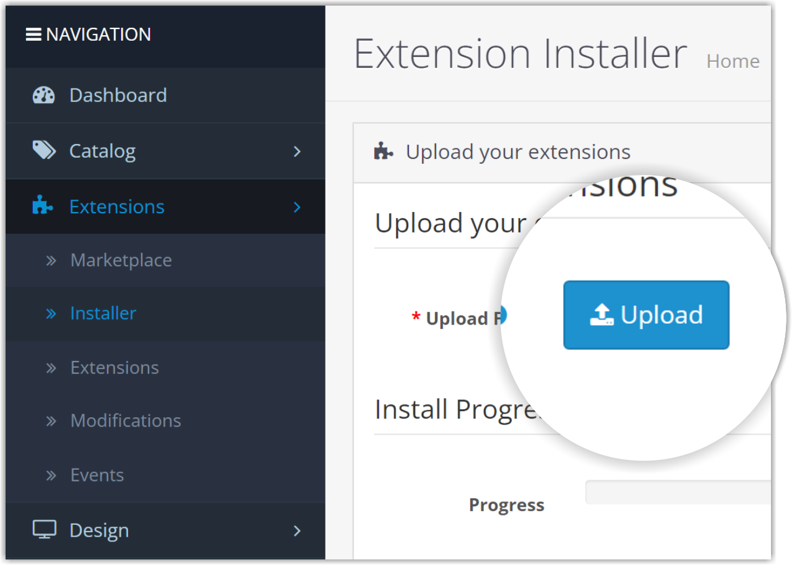

Localize o arquivo **instagra_gallery_multilang_3.x.ocmod.zip** que foi baixado anteriormente, selecione-o e clique no botão **_Abrir_** ou dê um duplo clique no nome do arquivo.

Aguarde a instalação ser concluída e o módulo será listado na tabela de **_Histórico de Instalação_**.

Acesse **_Extensões_ > _Modificações_** e clique no botão **_Atualizar_**.

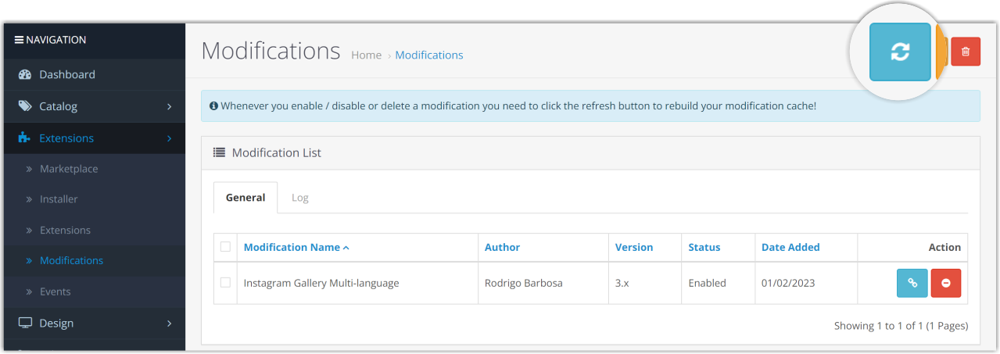

# Instalar o módulo
Acesse **_Extensões_ > _Extensões_**, selecione **_Módulos_** no menu suspenso, localize o **_Instagram Gallery Multilang_** e, em seguida, clique no botão **_Instalar_** no final da linha.

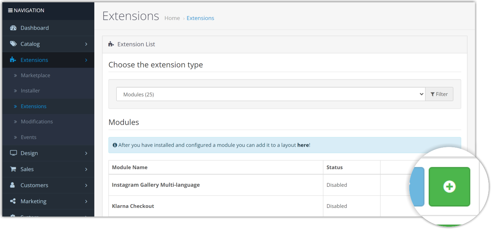

# Galerias
Sobre os tipos de galeria
>Existem duas maneiras de criar uma galeria:
>1. [_Galeria Principal_ ou _Galeria Pai_](#criar-uma-galeria-principal): Este tipo de galeria irá conter a configuração da API do Instagram. Várias Galerias Principais podem ser criadas, cada uma com uma configuração de API diferente.
>2. [_Galeria Clone_ ou _Galeria Filho_](#criar-uma-galeria-clone): Este tipo de galeria usará as configurações de API da Galeria Principal. Várias Galerias Clone também podem ser criadas para cada Galeria Principal.

## Criar uma Galeria Principal
Vá para **_Extensões_ > _Extensões_**, selecione **_Módulos_** no menu suspenso, localize **_Instagram Gallery Multilang_**, e clique no botão **_Editar_** no final da linha.

Digite o nome da _nova galeria_ e clique no botão Salvar. O nome da galeria pode ser alterado posteriormente.

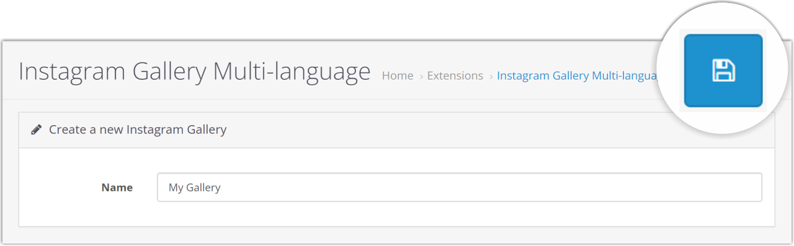

## Criar uma Galeria Clone
Vá para **_Extensões_ > _Extensões_**, selecione **_Módulos_** no menu suspenso, localize **_Instagram Gallery Multilang_**, e clique no botão **_Editar_** no final da linha.

Digite o nome da _nova galeria filho_, selecione a _galeria pai_ e clique no botão Salvar. O nome da galeria pode ser alterado posteriormente.

# Configuração da API (Somente para Galerias Principais )

Este capítulo/tutorial demonstra como configurar um aplicativo do Instagram no painel do aplicativo e como configurar a API para o módulo.

>Antes de começar, certifique-se de que você já possui uma [Conta de Desenvolvedor do Facebook](https://developers.facebook.com/) e que a loja não está em modo de manutenção.

## Crie um aplicativo do Facebook

Acesse a [Conta de Desenvolvedor do Facebook](https://developers.facebook.com/), clique em **_Meus Apps_** e crie um novo aplicativo.

Escolha o tipo de aplicativo **_Consumidor_** ou **_Nenhum_**.

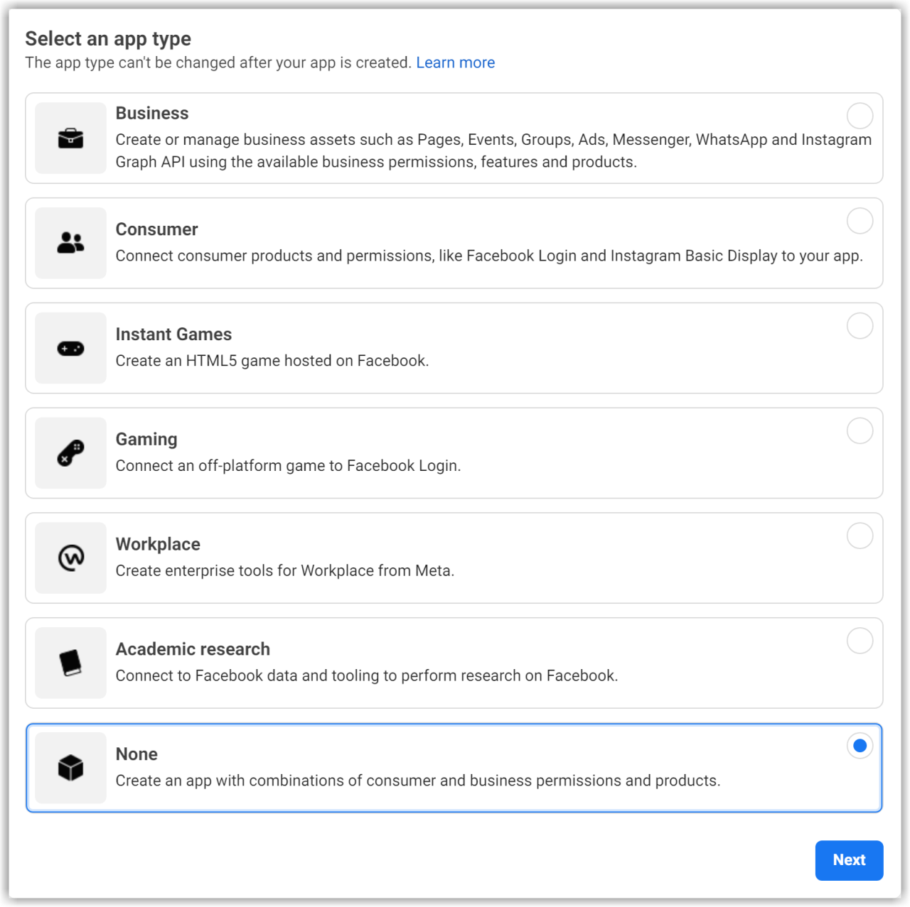

Adicione um nome de aplicativo.

Depois de criar o aplicativo, vá para o Painel do aplicativo, navegue até **_Configurações > Básico_**, role até o final da página e clique em **_Adicionar plataforma_**.

Escolha **_Website_** e clique em **_Avançar_**.

Adicione a URL do seu website e salve as alterações.

>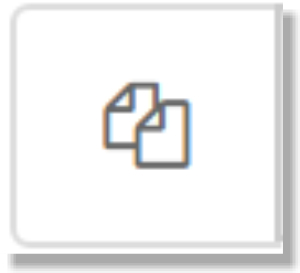
>Clique neste botão para copiar a URL da loja.

## Módulo de configuração da API e exibição básica do Instagram
Clique em **_Produtos_**, localize o produto **_Instagram Basic Display_** e clique em **_Configurar_** para adicioná-lo ao seu aplicativo.

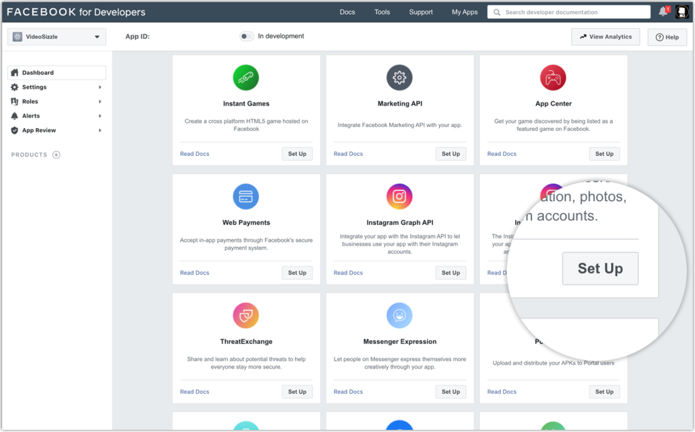

Role a página para baixo e clique em **_Criar novo aplicativo_**.

Digite o nome do aplicativo do Facebook que você acabou de criar.

Por favor, volte para a aba API do módulo, copie a URL da loja e cole-a nos campos **_URI de redirecionamento OAuth válida_**, **_URL de retorno de chamada de desautorização_** e **_URL de solicitação de exclusão de dados_**, em seguida, clique em 'Salvar'.

No formulário de Exibição Básica do Instagram, copie os números do **_ID do aplicativo do Instagram_** e do **_segredo do aplicativo do Instagram_** e cole-os na aba API do módulo.

## Adicionar um usuário de teste do Instagram
Navegue até **_Funções > Funções_** e role para baixo até a seção **_Adicionar testadores do Instagram_**. Em seguida, clique em **_Adicionar testadores do Instagram_** e digite o nome de usuário da sua conta do Instagram antes de enviar o convite.

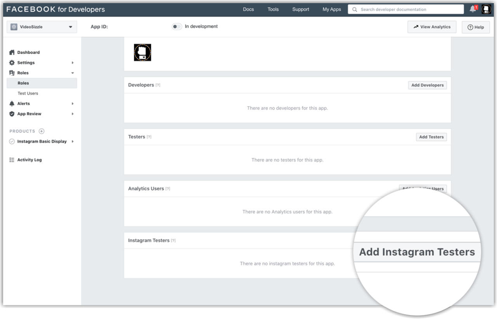

Abra um novo navegador da web e vá para o instagram.com. Faça login na sua conta do Instagram recém-convidada. Navegue até **_(Ícone do perfil) > Editar perfil > Aplicativos e sites > Convites de teste_**, e aceite o convite.

Sua conta do Instagram agora é elegível para ser acessada por meio do seu aplicativo do Facebook.

## Autenticar o usuário
Vá para a aba API do módulo e clique no botão **_Autorização_**.

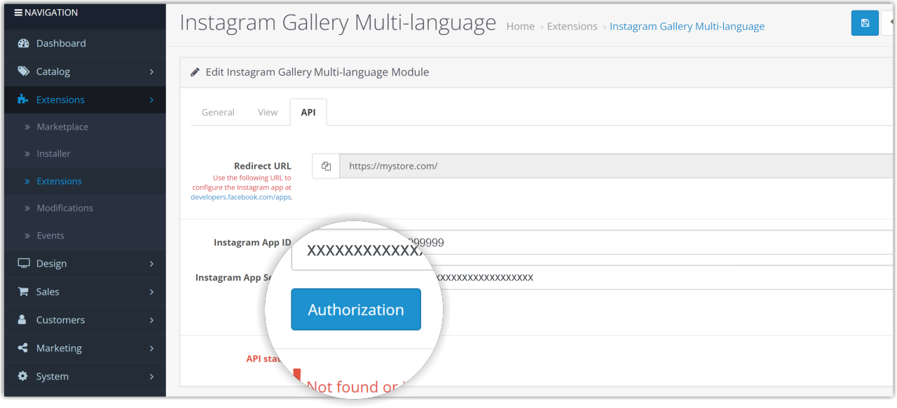

Clique no botão **_Abrir Janela de Autorização_** ou copie e cole o link em seu navegador. É necessário estar logado na conta do Instagram que fornecerá a mídia para a galeria.

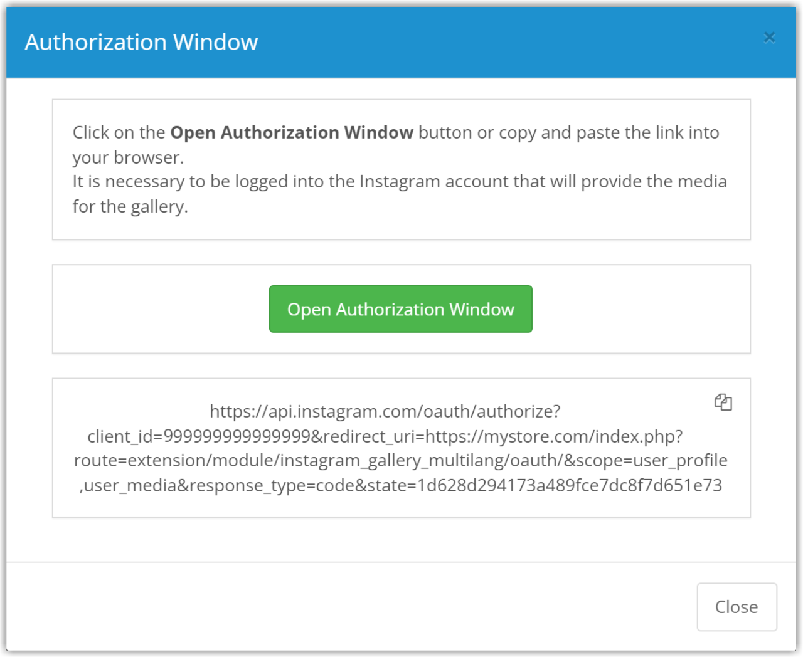

A janela de autorização deve aparecer e exibir seu nome de usuário do Instagram, o nome do aplicativo e uma descrição das permissões que está solicitando. Clique em **_Autorizar_** para conceder acesso do aplicativo aos dados do seu perfil.

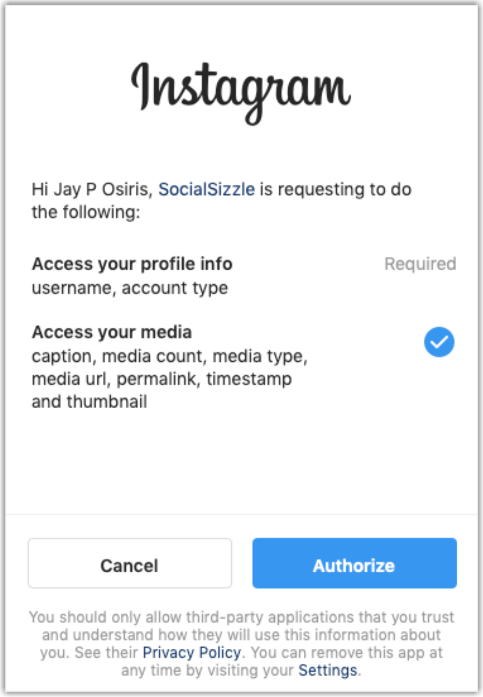

Por favor, acesse a página do módulo e atualize-a. Em seguida, vá para a aba API e verifique se o status da API exibe a mensagem de API configurada correta.

A configuração para o Instagram Basic Display e a API do módulo está completa quando o status da API exibe a mensagem de API configurada correta. Configure as configurações Gerais e de Visualização e clique no botão 'Salvar' no topo da página para criar sua galeria.

# Aba de configuração geral

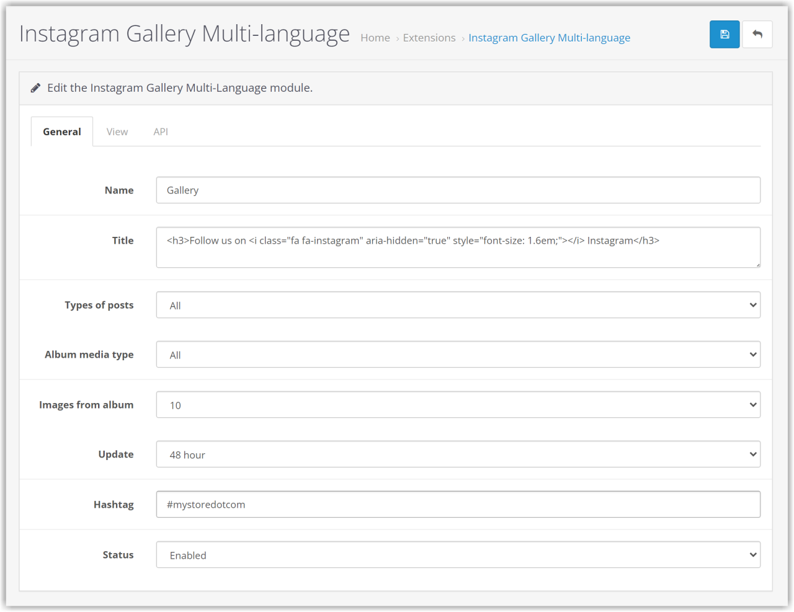

+ **Nome**: Este texto é usado para identificar a galeria. Nomes duplicados para galerias não são permitidos.
+ **Título**: O título que será exibido acima da galeria permite que você use HTML e CSS.
+ **Tipos de postagens**: Tipos de postagens do Instagram que fornecerão conteúdo para a galeria.
+ **Tipo de mídia do álbum**: Tipos de mídia que serão fornecidos dos álbuns.
+ **Imagens do álbum**: A quantidade de mídia que será fornecida dos álbuns.
+ **Atualização**: Período durante o qual a imagem mais antiga da galeria será atualizada.
+ **Hashtag**: Hashtag usada para marcar os posts que o módulo irá procurar.
+ **Status**: Status da galeria.

## Hashtag
Na aba Geral, configure a hashtag que será utilizada para marcar os posts que o módulo deverá procurar para criar a galeria. Postagens que não tiverem a hashtag serão ignoradas pelo módulo.

# Aba de configuração de visualização

+ **Mídia por visualização**: O número máximo de imagens que será exibido.
+ **Tipo de visualização**: Tipo de visualização.
+ **Paginação**: Mostrar pontos de paginação.
+ **Efeito de zoom**: Tipo de efeito de zoom quando o mouse paira sobre a imagem.
+ **Bordas arredondadas**: Aplicar bordas arredondadas às imagens.
+ **Inclinação**: Aplicar um efeito de inclinação na imagem.
+ **Efeito de cor**: Tipo de efeito de cor quando o mouse paira sobre a imagem.
+ **Legenda**: Exibir parte da legenda da postagem.
+ **Link para postagem original**: Acessar as postagens originais clicando nas imagens.
+ **Móvel**: Exibir a galeria em dispositivos com resolução de tela inferior a 576px.

# Exibir a galeria no layout.
Vá para **_Design_ > _Layouts_**, encontre o layout onde deseja exibir a galeria e clique em **_Editar_** no final da linha.

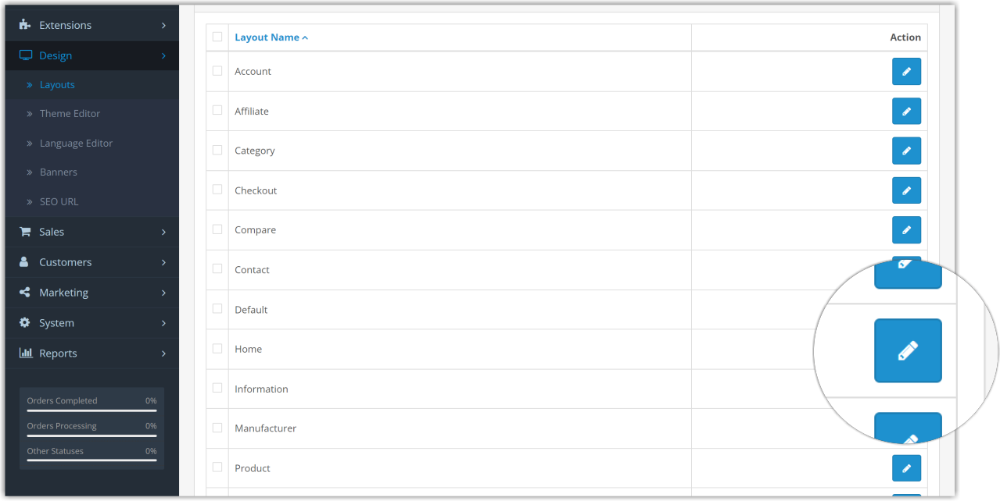

Escolha a posição na qual a galeria será exibida. No menu suspenso, localize a galeria pelo nome, clique no botão **_Adicionar módulo_** e salve as alterações.
Neste exemplo, configuraremos a galeria para ser exibida na parte inferior do conteúdo.

# Permissões de acesso e modificação
Vá para **Sistema > Usuários > Grupos de usuários**, localize seu grupo pelo nome e clique em **_Editar_** no final da linha.

Nas listas **_Permissões de acesso_** e **_Permissões de modificação_**, localize a linha **_extension/module/instagram_gallery_multilang_** e certifique-se de que está marcada.

# Desinstalar

Ao desinstalar o módulo, todas as configurações, galerias e mídias serão excluídas.

Vá para **_Extensões > Instalador_**, localize o módulo e clique em **_Desinstalar_** no final da linha.

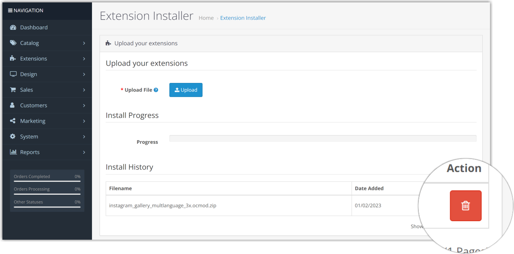

# Solução de problemas
Acesse a [página de solução de problemas](https://github.com/ab-rodrigo/instagram-gallery-multilang-docs/blob/main/troubleshooting.md).

# Licença
GNU General Public License version 3 (GPLv3) - https://www.gnu.org/

# Como obter ajuda
Por favor, acesse a [página do módulo](https://www.opencart.com/index.php?route=marketplace/extension/info&extension_id=44768&filter_member=Rodrigoabr) e clique no botão "Obter suporte".

# Contato
Rodrigo Barbosa - ab.rodrigo@outlook.com

# Buy me a coffee

